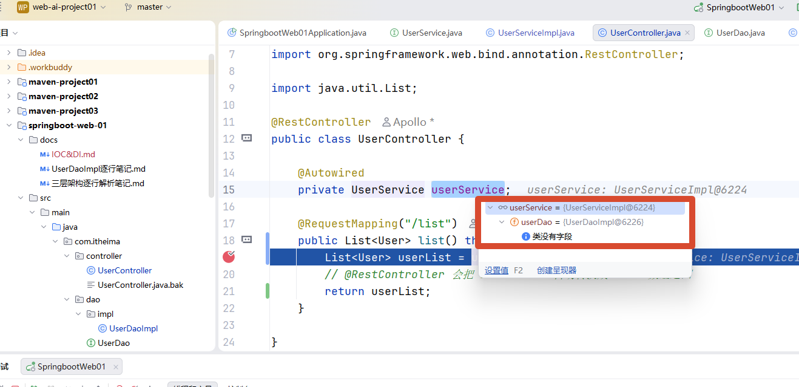

# IOC&DI

#### 简单解释

**IOC**：对象由 Spring 创建和管理
**DI** ：Spring 把对象需要的依赖注入进去

---





运行的过程中就完成了依赖注入的操作

这就意味着:

```
UserController
      ↓ @Autowired
UserServiceImpl
      ↓ @Autowired
UserDaoImpl

-----------------------------

Spring 容器
   │
   ├── UserController
   │       │
   │       └── userService → UserServiceImpl
   │                              │
   │                              └── userDao → UserDaoImpl
   │
   └── 负责整个对象关系的创建和组装
```

>  整个依赖链已经被Spring容器创建并封装起来了，体现了**低耦合**

