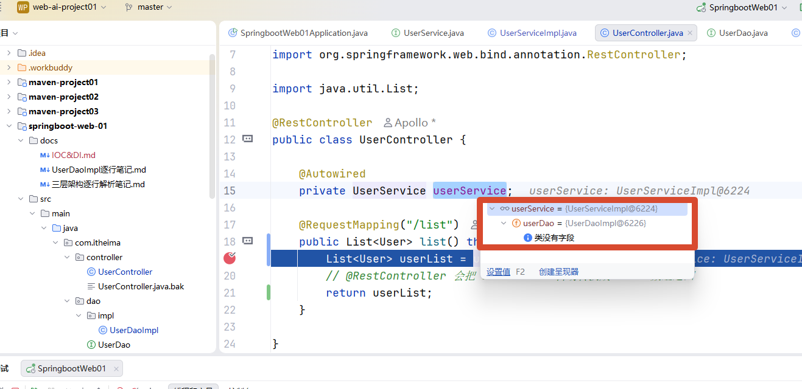
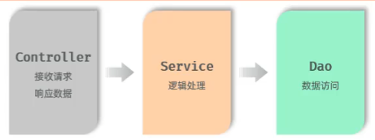
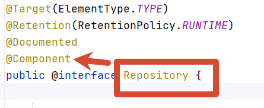
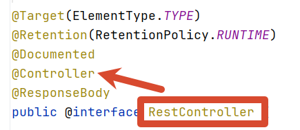

# IOC&DI

#### 简单解释

**IOC**：对象由 Spring 创建和管理
**DI** ：Spring 把对象需要的依赖注入进去

---





运行的过程中就完成了依赖注入的操作

这就意味着:

```
UserController
      ↓ @Autowired
UserServiceImpl
      ↓ @Autowired
UserDaoImpl

-----------------------------

Spring 容器
   │
   ├── UserController
   │       │
   │       └── userService → UserServiceImpl
   │                              │
   │                              └── userDao → UserDaoImpl
   │
   └── 负责整个对象关系的创建和组装
```

>  整个依赖链已经被Spring容器创建并封装起来了，体现了**低耦合**


## IOC详解

要把某个对象交给IOC容器管理，需要在对应的类上加上如下的注解之一：

| 注解 | 说明 | 位置 |
| :--: | :--: | :--: |
|   @Component   | 声明bean的基础注解 | 不属于以下三类时，用此注解 |
| @Controller | @Component的衍生注解 | 标注在控制层类上 |
| @Service | @Component的衍生注解 | 标注在业务层上 |
| @Repository | @Component的衍生注解 | 标注在数据访问层类上（由于与mybatis整合，用的少） |







## DI详解

基于@Autowired进行依赖注入有三种写法:

1. 属性注入

```java
@RestController
public class UserController {
    @Autowired
    private UserService userService;
}
```

> 优点: 代码简洁、方便快速开发
>
> 缺点：隐藏了类之间的依赖关系、可能会破坏类的封装性

2. 构造函数注入

```java
@RestController
public class UserController {
    private final UserService userService;
    @Autowired
    public UserController(UserService userService){
        this.userService = userService;
    }
}
```

>优点：能清晰地看到类的依赖关系、提高了代码的安全性
>
>缺点：代码繁琐、如果构造参数过多，可能导致构造函数臃肿。
>
>注意：如果只有一个构造方法，@Autowired注解可以省略

3. setter注入

```java
@RestController
public class UserController {
    private UserService userService;
    @Autowired
    public void setUserService(UserService userService){
        this.userService = userService;
    }
}
```

> 优点：保持了类的封装性，依赖关系更清晰
>
> 缺点：需要额外编写setter方法，增加了代码量